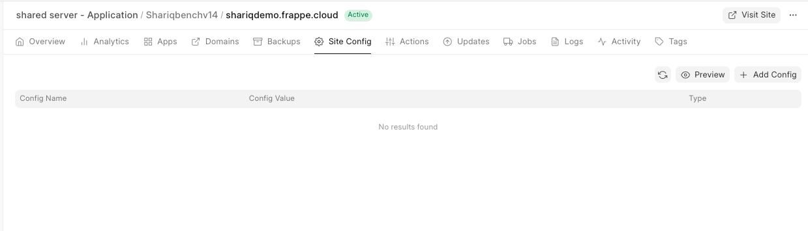

[Site Config](https://frappeframework.com/docs/v13/user/en/basics/sites#site-config) is the Frappe Framework way of specifying environment variables.

Site Config let's you configure options that is specific to a single site.

For e.g.

* Configure an Email account to send emails from.
* Disable Website Cache
* Disable [Global Search](https://docs.erpnext.com/docs/user/manual/en/using-erpnext/Global-search)
* Enable [Server Scripts](https://docs.erpnext.com/docs/user/manual/en/customize-erpnext/server-script)

Update Site Config
------------------

1. Go to the **Site Config** tab.
2. Enter values in the corresponding input field.
3. Click on **Update Configuration**.

  

FAQ
===

Why can't I enable developer\_mode?
-----------------------------------

When you enable developer mode, JSON files get created when you create any standard documents for e.g., DocType, Page, Report, Workspace, etc. These JSON files must be part of an app. You cannot add these files to the standard Frappe and ERPNext apps, you will need to [create your own app](https://frappecloud.com/docs/benches/custom-app). That is why you cannot enable developer mode on Frappe Cloud. You must create those features as a part of a custom app and then upload it on Frappe Cloud to use it.

