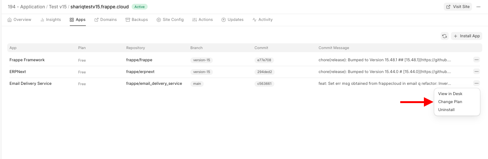
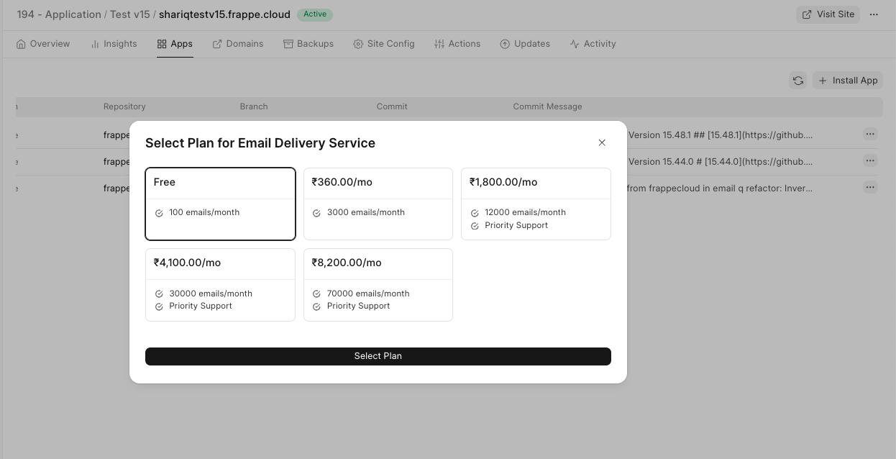
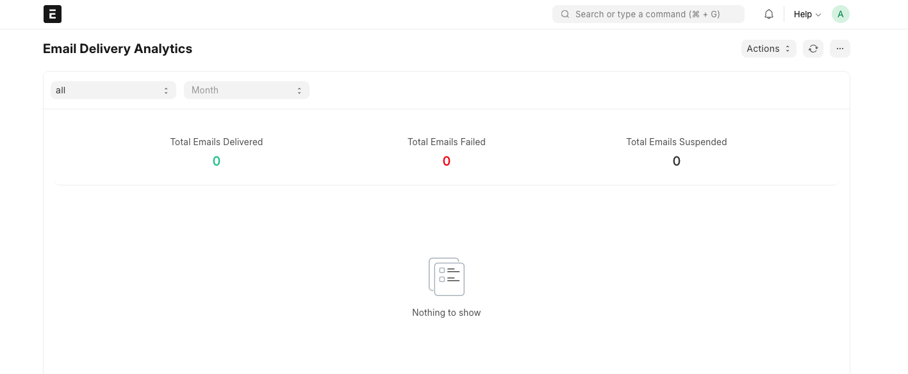

From your Frappe Cloud site dashboard navigate to the Apps tab and click on three dots from the Email Delivery Service app.  
  

Choose the plan you would like as per your requirements and click on select plan to confirm the change.  

> Once logged into your site, you can monitor the emails sent by searching for "**Email Delivery Analytics**" in the Awesome Bar.
> 
> 

  

  

FAQ
---

### How to use my own smtp server/service for sending emails?

Simply uninstall the email delivery service app from your site and you should be able to resume sending emails from your own configured email account.

  

