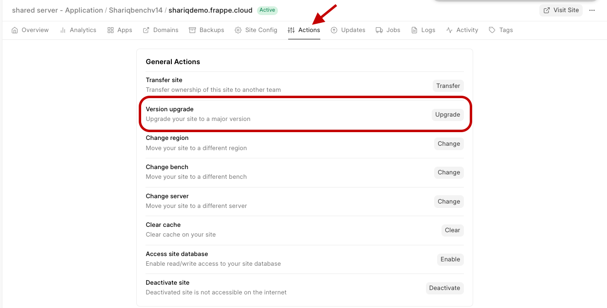
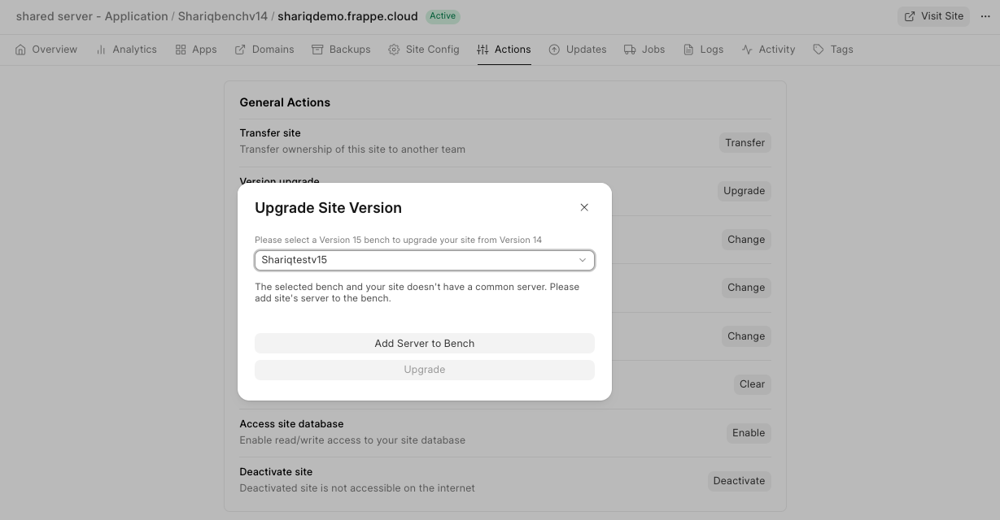
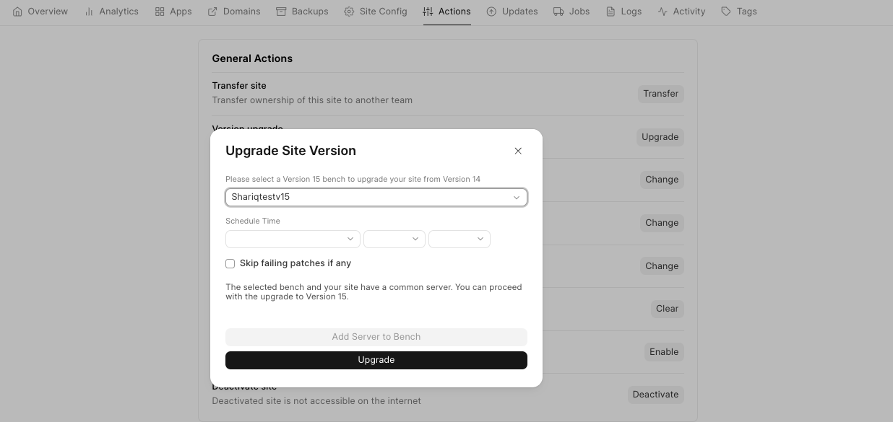
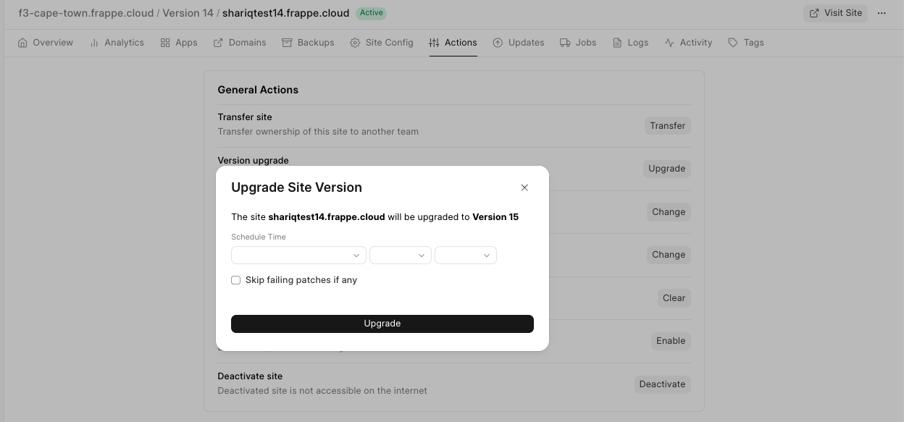

You can directly schedule version upgrades from a site's dashboard.

### Sites on Private Bench Groups

1. Create a bench group for your site to upgrade to. Example: If your site is currently v14 and you want to upgrade to v15, create a v15 bench group with all the apps installed in the site. Learn to create a new bench group from [here.](https://frappecloud.com/docs/benches/create-new)
2. To upgrade the version for your site, go to your Frappe cloud site Dashboard>Actions>Version Upgrade.

  

3. Select the bench group you want and it will be validated automatically and if there is no common server between site and target bench group, add site's server to the bench group.

  

4. If there is a common server between site and target bench group click Upgrade and the Version Upgrade will be done in the scheduled time (if you want to do it immediately leave it untouched).

  

### Sites on Public Bench Groups

1. To upgrade the version for your site, go to your Frappe cloud site Dashboard>Actions>Version Upgrade.

  

  

2. Click on Upgrade if your site is not on the latest version.

  

