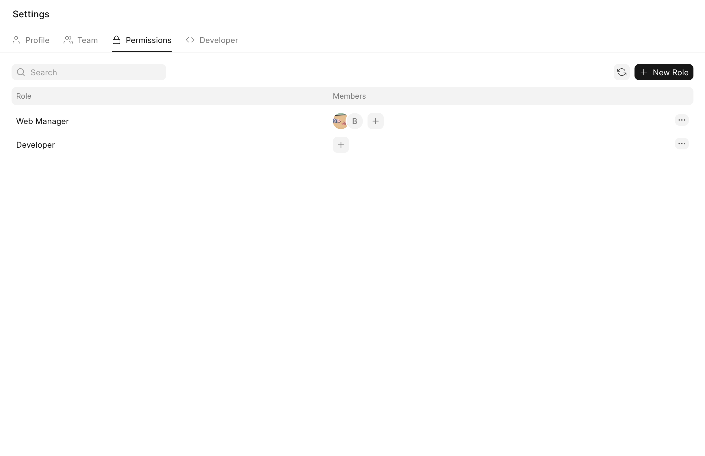
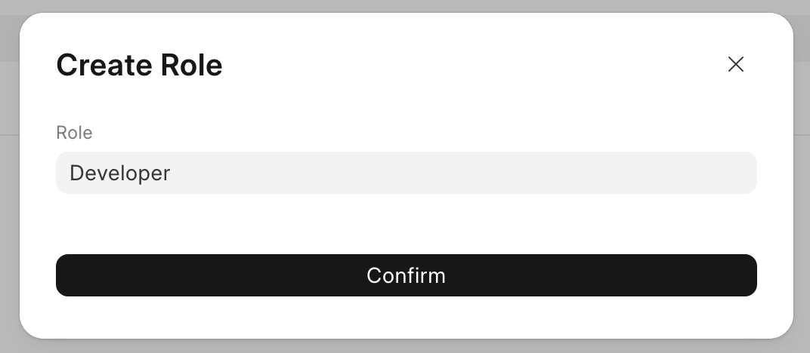
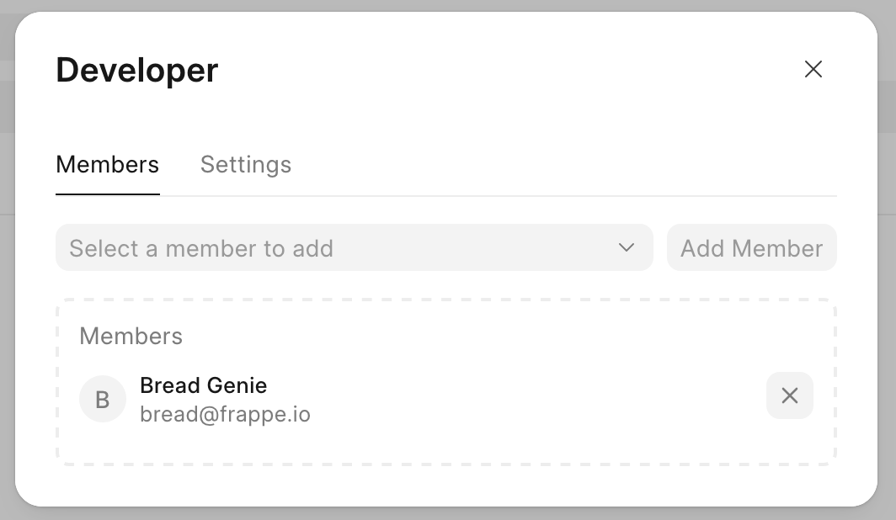
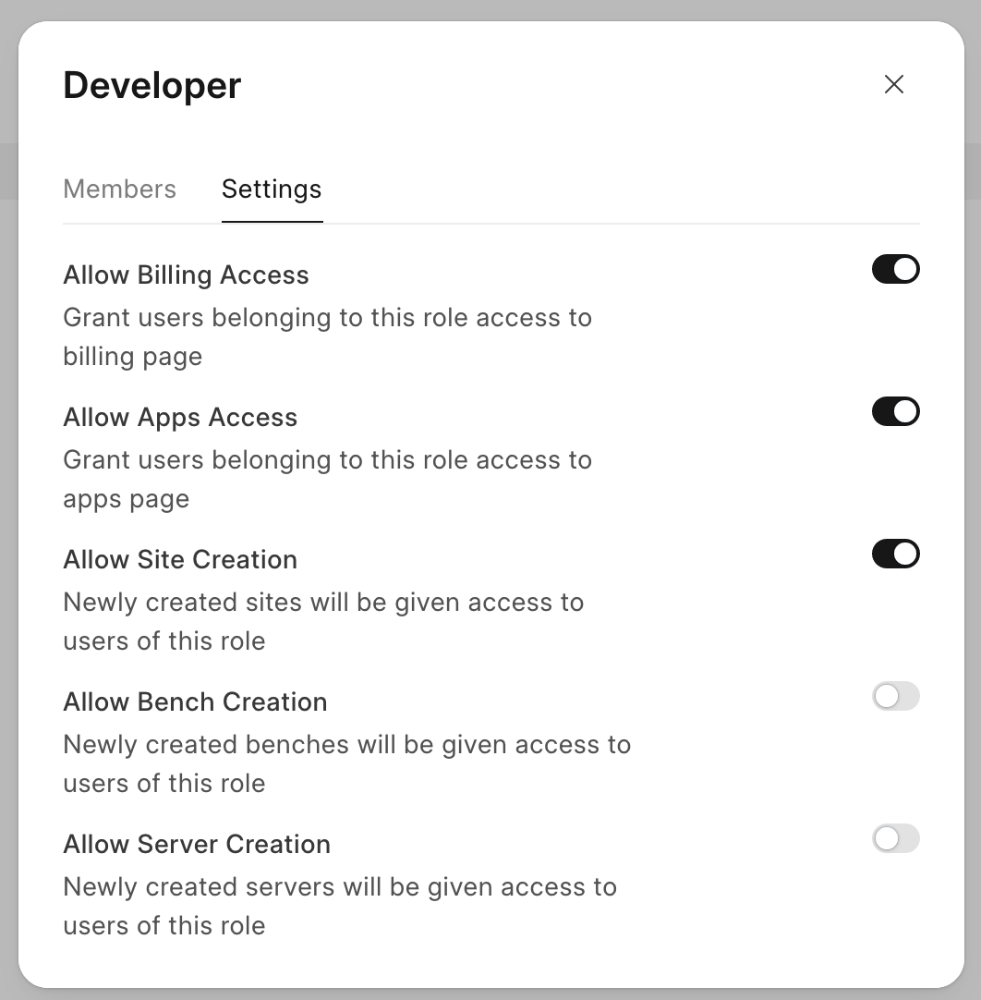
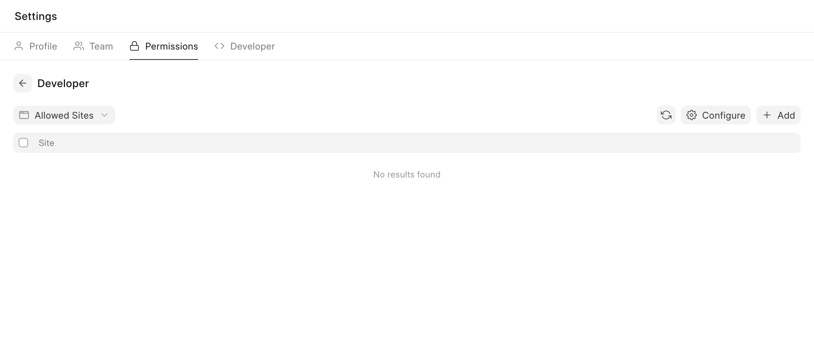
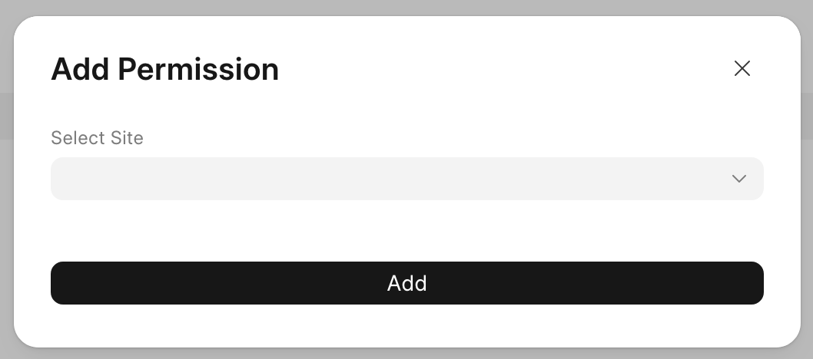

Frappe Cloud provides permission access for team members based on roles. They allow you to restrict access to site, bench group and server individually.

Configuring Permission
----------------------

> Configuring of permission is only allowed for Team owners and admins
> 
> 

* Go to Settings > Permissions

* Click on New Role, input the Role name and click on Confirm

* Select the + button to add members

* You can also configure additional settings in the Settings tab of the dialog

  

> Allowing Site/Bench Group/Server creation option will also ensure permissions for newly created Site/Bench Group/Server under that team.
> 
>
* Select the Role to add permissions for sites, bench groups or servers

* Click on Add, select the Site, Bench Group or Server and then click on Add to add permissions for them

> A newly added team member will have unrestricted access if they're not included in any of the role. Add a role to them while inviting them to restrict their access.
> 
> 

