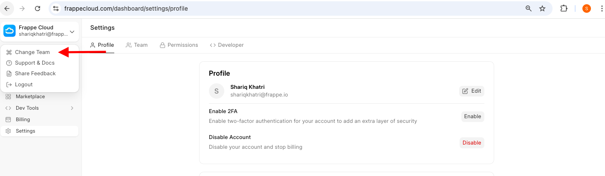
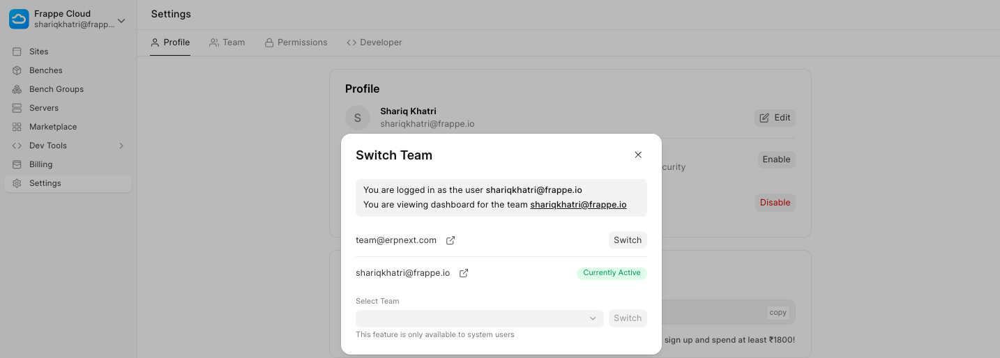

You can switch easily between teams from the Team section in Settings.

  

If you want to leave a team, first switch to some other team and then click on the Switch button under the Change Team action.  

Rememeber you can't leave your own team(created when you signup) since your the owner of that team.

