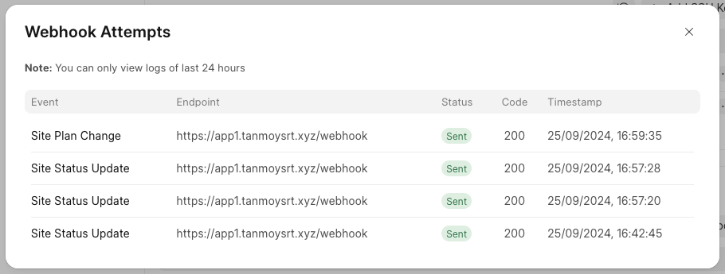
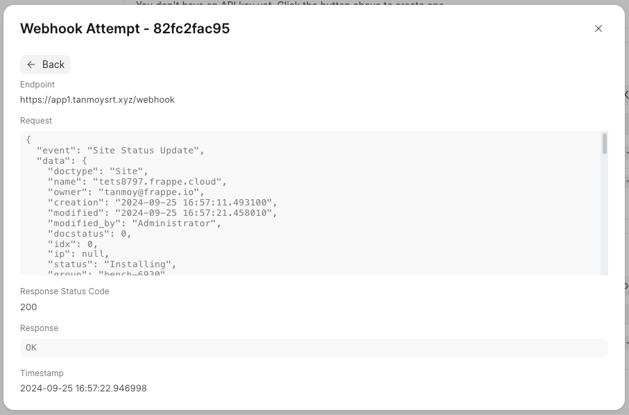

Webhook attempt logs are essential for diagnosing issues on the webhook backend. They allow the end-user to review the request payload, response, and status code, enabling more effective troubleshooting.

> You can only view logs of last 24 hours only.
> 
> 

From the webhook record's actions button, you will be able to open the `Webhook Attempts List`

  

  

You can click on a row to view the details of a specific webhook attempt.

  

