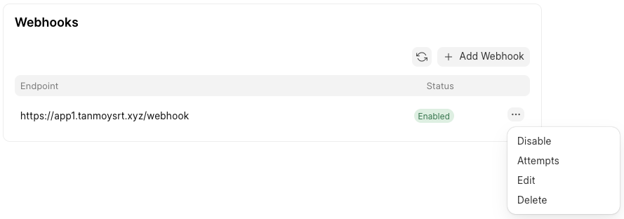
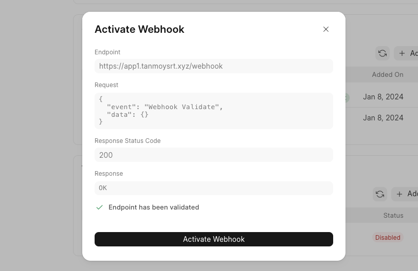

Webhook Payload Format
----------------------

Webhook requests are sent as POST requests, and the body contains the following information:


```
{
  "event": "Site Plan Change",
  "data": {
     // details of the resource
  }
}
```
Prerequisites
-------------

1. Your backend service should be up and running to accept incoming webhook requests.

  


At minimum, You need to handle `Webhook Validate` event to be able to validate and activate the webhook.

  


Here, it's a tiny flask app to get started with webhook -


```
from flask import Flask, request

app = Flask(__name__)

@app.route('/webhook', methods=['POST'])
def webhook():
    payload = request.get_json()
    event = payload['event']
    data = payload['data']

    print(f"Event: {event}")
    print(f"Data: {data}

")

    # This event is sent by FC at the time of webhook validation
    if event == "Webhook Validate":
        return 'OK'

    # Its just for demo purpose, you can write your business logic here
    return 'OK'

if __name__ == '__main__':
    app.run(debug=True)
```
2. Your backend should be publicly accessible.

Setup Guide
-----------

1. Visit `Developer Settings` inside Frappe Cloud dashboard (<https://frappecloud.com/dashboard/settings/developer>)
2. Click on `Add Webhook` button
3. Put your backend endpoint and select at-least one webhook event and submit.


> The `Secret` will be used for webhook authentication. This is an optional field.
> 
> Check the [Authentication](#authentication) section to learn more about this.
> 


4. Next, click on the `Activate` button of webhook record.


5. Click on `Validate Webhook`
6. If everything looks good, you can activate the webhook from there

  


  


  


Similarly, you will see one event on your backend -


```
Event: Webhook Validate
Data: {}
127.0.0.1 - - [24/Sep/2024 13:25:33] "POST /webhook HTTP/1.1" 200 -
```
7. Click on `Activate Webhook` to make it active.
8. That's all !

Authentication
--------------

You can configure a secret key for authentication at the time of webhook creation or use the `edit` option to update that

If you have provided secret key, Frappe Cloud will set that secret key in `X-Webhook-Secret` header of all webhook requests.

We can modify the tiny flask app to handle webhook authentication -


```
from flask import Flask, request

app = Flask(__name__)

@app.route('/webhook', methods=['POST'])
def webhook():
    # authorise webhook requests
    secret = request.headers.get('X-Webhook-Secret', "")
    if secret != "super-secret-key":
        return 'Unauthorized', 401

    payload = request.get_json()
    event = payload['event']
    data = payload['data']

    print(f"Event: {event}")
    print(f"Data: {data}")

    # This event is sent by FC at the time of webhook validation
    if event == "Webhook Validate":
        return 'OK'

    # Its just for demo purpose, you can write your business logic here
    return 'OK'

if __name__ == '__main__':
    app.run(debug=True)
```
